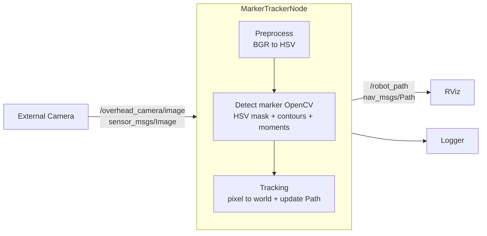

# ROS Robot Tracking

## 1. Общая информация о проекте

**Название проекта:** ROS Robot Tracking  
**Описание:**  
По картинке с внешней камерой система позволяет отслеживать позицию робота в абсолютных координатах использую цветную метку в реальном времени. Система реализована в среде ROS и использует методы компьютерного зрения (OpenCV) для обработки изображения и rviz для визуализации его траектории


## 2. Что видит пользователь

Пользователь системы видит:
1. Выделенную цветную метку на роботе в Gazebo.
2. Определённое положение робота (координаты).
3. Публикуемые в ROS данные, доступные другим узлам:
   - позиция робота,
   - траектория движения в rviz.


Пользователь может:
- запускать систему через ROS launch;
- подписываться на топики с данными локализации;
- использовать данные в навигации или управлении.


## 3. Архитектура системы

## 4. Структура проекта

- `marker_tracker_node.py` — основной ROS2-узел
- `vision.py` — детекция цветной метки (MarkerDetector)
- `transform.py` — преобразование pixel → world
- `path_recorder.py` — хранение и публикация траектории
- `logger.py` — обёртка над ROS logger
- `timer.py` — обёртка над ROS timer
- `config.py` — конфигурация и параметры системы

## 5. Сборка и запуск

### Требования
- ROS 2 Jazzy
- colcon
- Пакеты: `rclpy`, `sensor_msgs`, `geometry_msgs`, `nav_msgs`, `cv_bridge`
- Python зависимости: `numpy`, `opencv-python`

### Сборка workspace
```bash
source /opt/ros/jazzy/setup.bash
cd <workspace>
colcon build --symlink-install
```

### Запуск
```bash
source /opt/ros/jazzy/setup.bash
source <workspace>/install/setup.bash
ros2 launch robot_marker_tracking tracking.launch.py
```


## 6. ROS интерфейсы

### Подписки
- `/overhead_camera/image` (`sensor_msgs/Image`) — изображение с внешней камеры

### Публикации
- `/robot_path` (`nav_msgs/Path`) — траектория движения робота в frame `map`


## 7. Ограничения

- Детекция основана на цвете и чувствительна к освещению
- Используется аффинное преобразование, требующее предварительной калибровки
- Поддерживается одна цветная метка